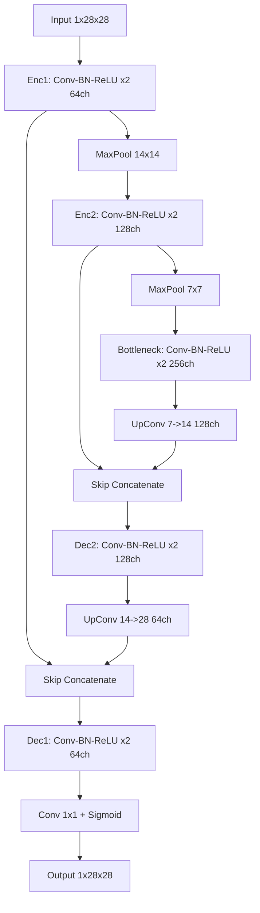

# Image Denoising

Relazione tecnico-operativa del progetto di **Image Denoising** sviluppato per il corso di Apprendimento Automatico e Apprendimento Profondo presso l'Universita degli Studi del Piemonte Orientale.

L'obiettivo della repository e mantenere un flusso sperimentale riproducibile per la rimozione del rumore su immagini grayscale, unendo una documentazione da relazione scolastica con istruzioni pratiche da repository GitHub.

## 1. Obiettivi del progetto

Gli obiettivi principali sono:

- Progettare un sistema end-to-end di denoising basato su Autoencoder convoluzionale.
- Addestrare e validare il modello su Fashion-MNIST con split stratificato.
- Integrare metriche quantitative rilevanti (MSE, PSNR, SSIM) per una valutazione robusta.
- Garantire tracciabilita sperimentale tramite checkpoint, log JSON e TensorBoard.
- Fornire script chiari per training, evaluation e inference.

## 2. Inquadramento metodologico

Il problema di denoising puo essere formalizzato come apprendimento di una funzione $f_\theta$ che mappa una versione rumorosa $\tilde{x}$ dell'immagine verso la versione pulita $x$:

$$
\hat{x} = f_\theta(\tilde{x}), \quad \tilde{x} = x + \epsilon
$$

dove $\epsilon$ rappresenta rumore additivo gaussiano.

Nel progetto, il rumore viene applicato in input con deviazione standard $\sigma = 0.3$, mentre il target resta l'immagine originale.

## 3. Dataset e preparazione dati

Il dataset utilizzato e **Fashion-MNIST**, caricato dai CSV in `data/raw`.

Pipeline dati implementata:

- Lettura immagini e label dal train set ufficiale.
- Split stratificato train/val/test interno in proporzione 80/10/10.
- Generazione coppie `noisy-clean` tramite rumore gaussiano additivo.
- Uso separato del test set ufficiale per la valutazione finale quantitativa.

Questa impostazione consente una validazione coerente durante il training e una stima finale non contaminata delle performance.

## 4. Architettura del modello

La rete e una variante piu capiente di autoencoder in stile U-Net leggero, con skip connections tra encoder e decoder per preservare informazione locale ad alta frequenza.



Scelte progettuali principali:

- **Skip connections**: migliorano la ricostruzione di contorni e texture, con impatto diretto su SSIM.
- **Canali 64-128-256**: aumentano la capacita rappresentazionale rispetto a una baseline piu piccola.
- **BatchNorm + ReLU**: stabilizzano il training e favoriscono convergenza piu regolare.

## 5. Funzione obiettivo e ottimizzazione

La loss adottata combina errore pixel-wise e coerenza strutturale:

$$
\mathcal{L} = \alpha \cdot \mathrm{MSE}(\hat{x}, x) + (1 - \alpha) \cdot \bigl(1 - \mathrm{SSIM}(\hat{x}, x)\bigr)
$$

con default $\alpha = 0.85$.

Motivazione:

- la componente MSE garantisce stabilita numerica e fedelta globale;
- la componente SSIM migliora qualita percettiva e struttura locale.

Tecniche di training incluse nella pipeline:

- AMP (mixed precision) per efficienza su GPU;
- scheduler `ReduceLROnPlateau`;
- early stopping su validazione;
- salvataggio automatico del best checkpoint.

## 6. Metriche di valutazione

Le metriche usate sono:

- **MSE (Mean Squared Error)**: errore medio quadratico tra output e target, definito come
    $$
    \mathrm{MSE} = \frac{1}{N}\sum_{i=1}^{N}(\hat{x}_i - x_i)^2
    $$
    dove valori piu bassi indicano ricostruzioni migliori.
- **PSNR (Peak Signal-to-Noise Ratio)**: misura logaritmica in decibel della qualita di ricostruzione rispetto al massimo valore di intensita:
    $$
    \mathrm{PSNR} = 10\log_{10}\left(\frac{\mathrm{MAX}^2}{\mathrm{MSE}}\right)
    $$
    dove valori piu alti indicano migliore fedelta del segnale ricostruito.
- **SSIM (Structural Similarity Index Measure)**: indice di similarita strutturale che confronta luminanza, contrasto e struttura locale tra immagine predetta e target.
    L'intervallo tipico e $[0,1]$, con valori piu vicini a 1 che indicano maggiore coerenza percettiva.

Le metriche vengono monitorate durante il training (train/val) e riportate su test ufficiale.

### 6.1 Analisi qualitativa inferenziale

Di seguito sono riportati tre esempi di inferenza su campioni del test set. Le immagini sono mostrate in colonna per facilitare la lettura anche quando il formato e molto largo ma poco alto.


*Figura 1: risultato di denoising sul campione con indice 93.*


*Figura 2: risultato di denoising sul campione con indice 1529.*


*Figura 3: risultato di denoising sul campione con indice 3397.*

### 6.2 Dinamica di addestramento

Per analizzare convergenza e stabilita del training, viene riportata la curva di loss su train e validation.


*Figura 4: andamento delle loss di train e validation durante l'addestramento.*

### 6.3 Confronto quantitativo finale

Il grafico seguente confronta le metriche finali su tre split: validation, internal test e official test.


*Figura 5: confronto finale di MSE, PSNR e SSIM tra split di validazione e test.*

## 7. Struttura della repository

Componenti principali:

- `src/config.py`: configurazione centralizzata (path, iperparametri, opzioni training).
- `src/data/dataset.py`: dataset e loader per coppie noisy-clean.
- `src/data/transforms.py`: trasformazioni e `AddGaussianNoise`.
- `src/models/autoencoder.py`: definizione architettura.
- `src/training/trainer.py`: loop di addestramento con AMP e validazione.
- `src/utils/visualization.py`: curve di loss e griglie qualitative.
- `scripts/train.py`: avvio training end-to-end.
- `scripts/evaluate.py`: valutazione quantitativa su test ufficiale.
- `scripts/inference.py`: inferenza su singola immagine.
- `tests/`: test unitari e di sanita dei componenti core.

## 8. Riproducibilita ed esecuzione

La gestione ambiente avviene tramite `uv`.

1. Sincronizzazione dipendenze:

```bash
uv sync
```

2. Esecuzione test:

```bash
uv run pytest -q
```

3. Training:

```bash
uv run python scripts/train.py
```

Output principali del training:

- `experiments/checkpoints/best_model.pth`
- `experiments/outputs/loss_curves.png`
- `experiments/outputs/denoising_samples.png`
- `experiments/outputs/train_final_metrics.json`
- `experiments/logs/train_history.json`
- `experiments/logs/tensorboard/`

Scalari TensorBoard disponibili per epoca:

- `loss/train`, `loss/val`
- `metrics/train_mse`, `metrics/val_mse`
- `metrics/train_psnr`, `metrics/val_psnr`
- `metrics/train_ssim`, `metrics/val_ssim`
- `train/lr`, `train/epoch_time_sec`

Avvio TensorBoard:

```bash
uv run tensorboard --logdir experiments/logs/tensorboard --port 6006
```

4. Valutazione su test ufficiale:

```bash
uv run python scripts/evaluate.py
```

Output principali della valutazione:

- `experiments/outputs/test_metrics.json`
- `experiments/outputs/test_denoising_samples.png`

5. Inferenza su singolo campione:

```bash
uv run python scripts/inference.py --index 3397
```

Output inferenza:

- `experiments/outputs/single_inference_idx_3397.png`

## 9. Nota conclusiva

Il progetto fornisce una base completa, modulare e riproducibile per esperimenti di image denoising su Fashion-MNIST, con una documentazione pensata sia per la valutazione accademica sia per l'uso pratico in sviluppo.