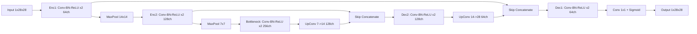

# Image Denoising

Repository per il progetto Image Denoising del corso di Apprendimento Automatico e Apprendimento Profondo presso l'Università degli Studi del Piemonte Orientale.

## Progetto 2: Rimozione del Rumore (Image Denoising) con Autoencoder

Il secondo progetto consiste nel realizzare un sistema di pulizia delle immagini (*image denoising*). Verrà implementata un'architettura basata su **Autoencoder** che, prendendo in input un'immagine soggetta a "rumore", restituirà una sua versione "pulita".

### Dataset e Metodologia

Il modello sarà addestrato sul dataset **Fashion-MNIST**. Per ottenere l'input per la rete, verrà applicato un opportuno filtro di rumore (*noise*) alle immagini originali. L'autoencoder imparerà a ricostruire l'immagine di partenza, rimuovendo di fatto il disturbo aggiunto.

## Pipeline Implementata

La repository ora include una pipeline completa conforme alle specifiche di progetto:

- Caricamento dataset Fashion-MNIST da CSV in data/raw
- Split stratificato train/val/test (80/10/10) sul train set ufficiale
- Additive Gaussian noise (sigma=0.3) per input rumorosi
- Convolutional Autoencoder con BatchNorm e decoder simmetrico
- Training con AMP, checkpointing del best model e early stopping
- Plot curve di train loss e val loss
- Generazione griglia immagini clean/noisy/denoised
- Stampa metriche finali a fine training (val + internal test)
- Salvataggio metriche finali su file JSON
- Valutazione quantitativa su test set ufficiale con MSE, PSNR e SSIM

## Architettura Del Modello (V2)

L'architettura corrente e una variante piu capiente in stile U-Net leggero, con skip connections tra encoder e decoder.



### Motivazioni Tecniche

- Skip connections: preservano dettagli locali (bordi, texture) che nel denoising hanno forte impatto visivo e su SSIM.
- Canali aumentati (64-128-256): maggiore capacita rappresentazionale rispetto al CAE base 32-64.
- Loss combinata MSE + (1-SSIM): MSE stabilizza il fit pixel-wise, SSIM migliora coerenza strutturale percettiva.
- Scheduler ReduceLROnPlateau: riduce automaticamente il learning rate quando la validazione smette di migliorare.
- AMP su GPU: mantiene training veloce senza compromettere la qualita nel tuo scenario.

La loss usata e:

$$
\mathcal{L} = \alpha \cdot \mathrm{MSE}(\hat{x}, x) + (1-\alpha) \cdot (1 - \mathrm{SSIM}(\hat{x}, x))
$$

con valore di default $\alpha = 0.85$.

### Stima Tempi (RTX 4090)

- Architettura base precedente: circa 30 secondi per training completo.
- Architettura V2 attuale (piu capiente): in media circa 1-3 minuti, dipendendo da carico sistema, num_workers e stato cache.

La stima resta coerente con il requisito operativo di rimanere nell'ordine di pochi minuti.

## Struttura Principale

- src/config.py: configurazione centrale
- src/data/dataset.py: loader CSV e dataset per coppie noisy-clean
- src/data/transforms.py: trasformazione AddGaussianNoise
- src/models/autoencoder.py: architettura del modello
- src/training/trainer.py: training loop con AMP
- src/utils/visualization.py: plot curve loss + griglia denoising
- scripts/train.py: addestramento end-to-end
- scripts/evaluate.py: valutazione su test ufficiale
- scripts/inference.py: inferenza su singola immagine
- tests/: test unitari di base

## Esecuzione con UV

1. Sincronizza dipendenze:

```bash
uv sync
```

2. Addestramento:

```bash
uv run python scripts/train.py
```

Output principali:

- experiments/checkpoints/best_model.pth
- experiments/outputs/loss_curves.png
- experiments/outputs/denoising_samples.png
- experiments/outputs/train_final_metrics.json
- experiments/logs/train_history.json
- experiments/logs/tensorboard/

Scalari disponibili su TensorBoard per epoca:

- loss/train, loss/val
- metrics/train_mse, metrics/val_mse
- metrics/train_psnr, metrics/val_psnr
- metrics/train_ssim, metrics/val_ssim
- train/lr, train/epoch_time_sec

Per aprire TensorBoard:

```bash
uv run tensorboard --logdir experiments/logs/tensorboard --port 6006
```

3. Valutazione test ufficiale:

```bash
uv run python scripts/evaluate.py
```

Output principali:

- experiments/outputs/test_metrics.json
- experiments/outputs/test_denoising_samples.png

4. Inferenza singola immagine:

```bash
uv run python scripts/inference.py --index 17
```

Output:

- experiments/outputs/single_inference_idx_17.png

## Test

```bash
uv run pytest -q
```